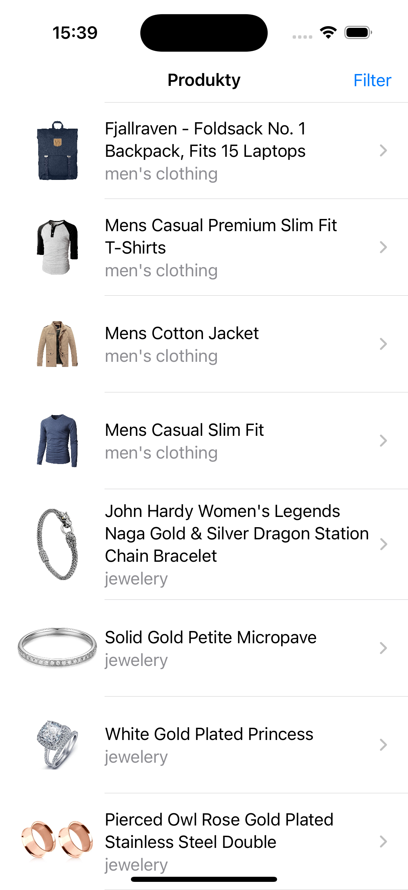
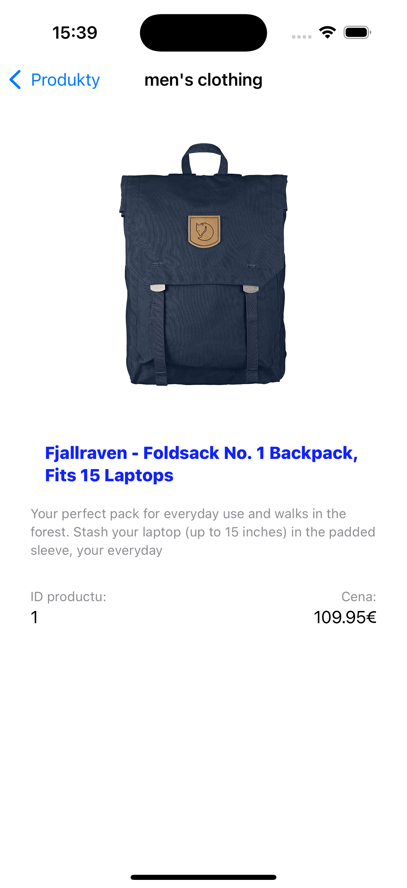
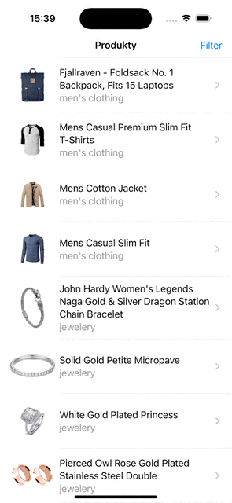

# Fake store app
This IOS appliction tesk task is created as a part of interview for codium.sk by Roman Holovai at 19.10.2024

# Criteria of app:
- [x] iOS 15+
- [x] Swift
- [x] SwiftUI
- [x] Codable
- [x] Alamofire
- [x] Async / PromiseKit
- [x] Git

# Screenshots & screen video:

  
  
  

